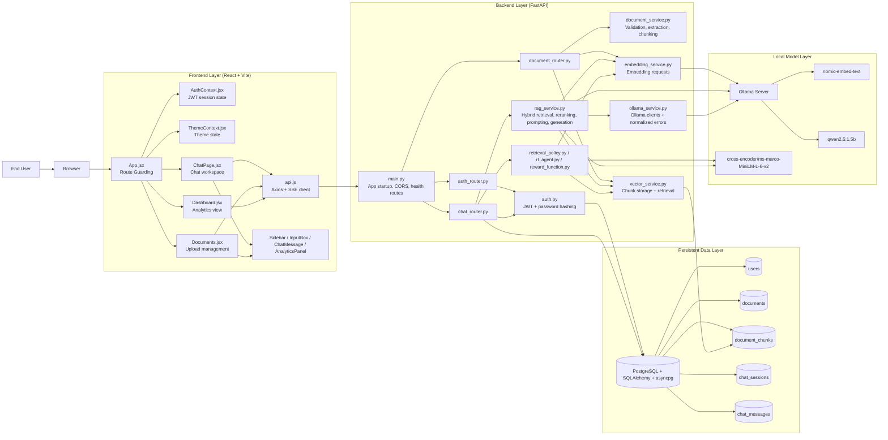
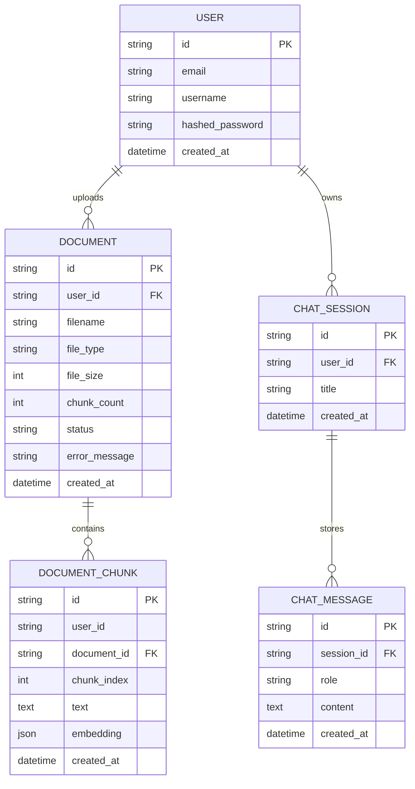
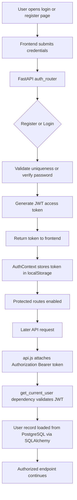
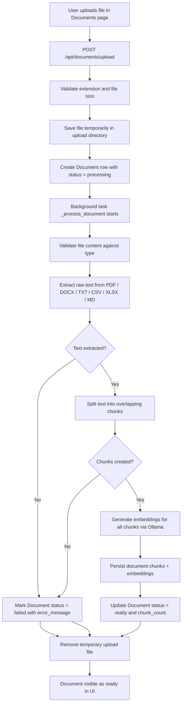
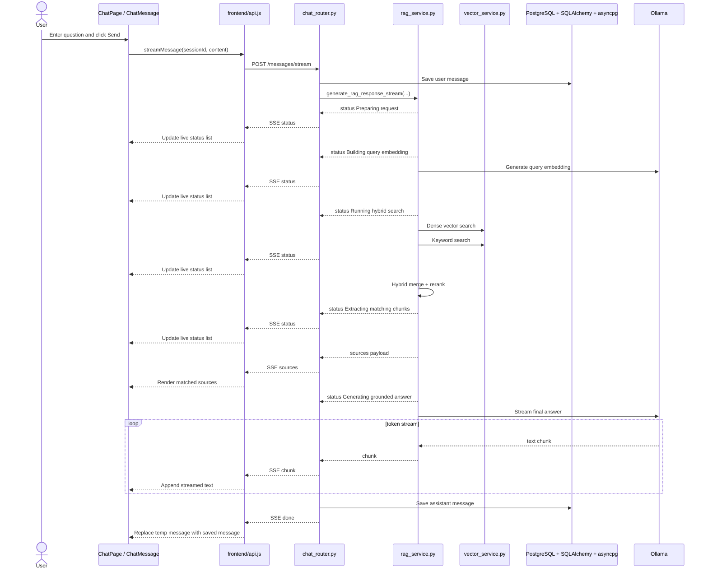
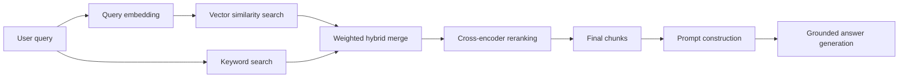
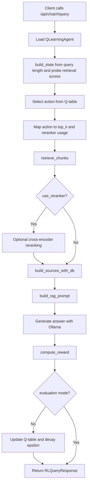

# RAG Chatbot Architecture and Flow Diagrams

This document describes the current architecture and execution flow of the project in a report-friendly format.
The diagrams are based on the code currently present in this repository.

Database note:
- The current active configuration uses PostgreSQL + SQLAlchemy + asyncpg through `backend/environment/.env`.
- The code still contains a SQLite fallback in `backend/app/config.py` if `DATABASE_URL` is omitted.

## 1. System Architecture Overview



## 2. Logical Component View

| Layer | Main Files | Responsibility |
|---|---|---|
| UI | `frontend/src/App.jsx`, `pages/*.jsx`, `components/*.jsx` | Routing, chat UI, document UI, dashboard, status panel |
| Frontend Integration | `frontend/src/api.js` | Axios REST calls, SSE stream parsing, token handling |
| API Entry | `backend/app/main.py` | FastAPI app setup, middleware, CORS, health checks |
| Auth | `backend/app/auth.py`, `backend/app/routers/auth_router.py` | Register, login, JWT issue/validation, password reset |
| Document Pipeline | `backend/app/routers/document_router.py`, `document_service.py`, `embedding_service.py`, `vector_service.py` | Upload, validate, extract text, chunk, embed, store chunks |
| Chat / RAG | `backend/app/routers/chat_router.py`, `rag_service.py` | Session handling, streaming, retrieval, reranking, prompt building, grounded generation |
| Retrieval Store | `backend/app/models.py`, `vector_service.py` | Chunk persistence and search over stored embeddings + keywords |
| Model Access | `backend/app/services/ollama_service.py` | Shared Ollama clients and error normalization |
| Evaluation / RL | `backend/retrieval_policy.py`, `backend/rl_agent.py`, `backend/reward_function.py`, `backend/evaluation_runner.py` | Experimental retrieval policy selection and offline evaluation |

## 3. Database / Entity Relationship Diagram



## 4. Authentication Flow



## 5. Document Upload and Indexing Flow



## 6. Main Chat / RAG Processing Flow

```mermaid
flowchart TD
    A[User sends question from ChatPage]
    B{Active session exists?}
    C[Create new session if needed]
    D[POST /api/chat/sessions/{id}/messages/stream]
    E[Save user message in chat_messages]
    F[Load recent chat history]
    G[Emit SSE status: Preparing request]
    H[Detect response mode]
    I[Emit SSE status: Building query embedding]
    J[generate_query_embedding_async]
    K[Emit SSE status: Running hybrid search]
    L[query_similar_chunks]
    M[query_keyword_chunks]
    N[merge_and_rerank]
    O[apply_cross_encoder_reranking]
    P[build_sources_with_db]
    Q[Emit SSE status: Extracting matching chunks]
    R{Relevant chunks found?}
    S[Return fallback answer]
    T[build_rag_prompt + SYSTEM_PROMPT]
    U[Emit SSE status: Generating grounded answer]
    V[Stream LLM response from Ollama]
    W[Accumulate assistant answer]
    X[Save assistant message in chat_messages]
    Y[Emit SSE done event]
    Z[Frontend replaces temporary message with saved response]

    A --> B
    B -- No --> C --> D
    B -- Yes --> D
    D --> E --> F --> G --> H --> I --> J --> K --> L --> M --> N --> O --> P --> Q --> R
    R -- No --> S --> X --> Y --> Z
    R -- Yes --> T --> U --> V --> W --> X --> Y --> Z
```

## 7. Streaming Status and Answer Sequence



## 8. Internal Retrieval Logic



## 9. RL Retrieval Evaluation Flow

This path is separate from the normal chat endpoint and is used for experimentation and evaluation.



## 10. End-to-End Summary

The runtime architecture can be understood as four connected pipelines:

1. Authentication pipeline: React auth pages -> FastAPI auth router -> JWT -> protected route access.
2. Document pipeline: Upload -> background extraction -> chunking -> embeddings -> local chunk store.
3. Chat pipeline: Question -> hybrid retrieval -> reranking -> grounded generation -> SSE streaming back to UI.
4. Evaluation pipeline: RL action selection -> retrieval experiment -> reward computation -> Q-table update.

For B.Tech documentation, the most useful diagrams are usually:

- System Architecture Overview
- Document Upload and Indexing Flow
- Main Chat / RAG Processing Flow
- Streaming Status and Answer Sequence
- Database / Entity Relationship Diagram
